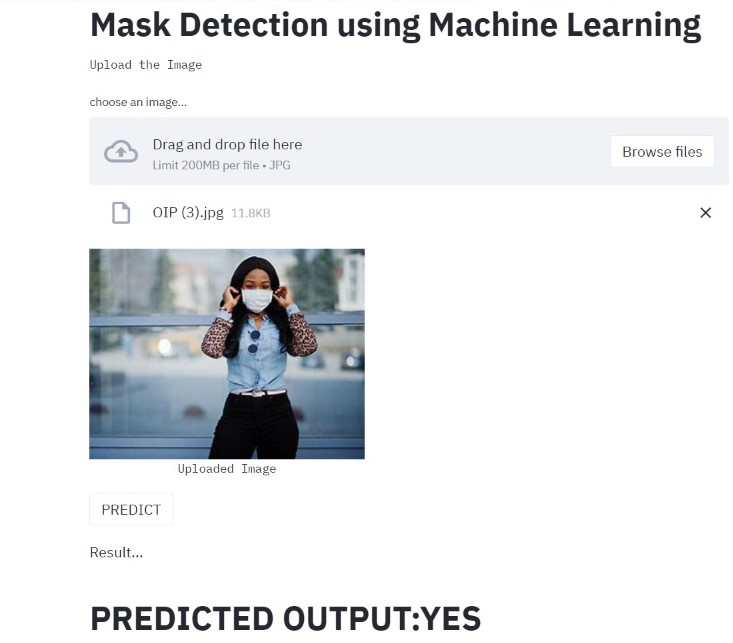
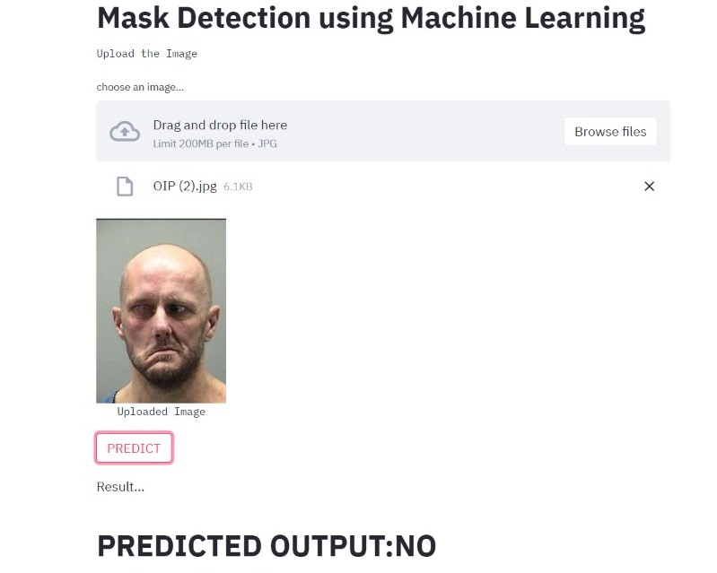

# Mask Detector
This project uses Support Vector Machine to classify images based on the inputs it is trained with.
We train the model using images of people wearing masks and people not wearing a mask.
The model can then predict whether a person is wearing a mask or not.

